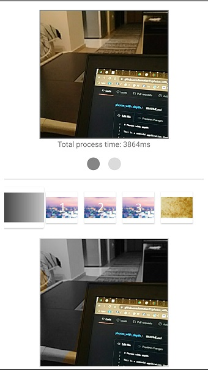
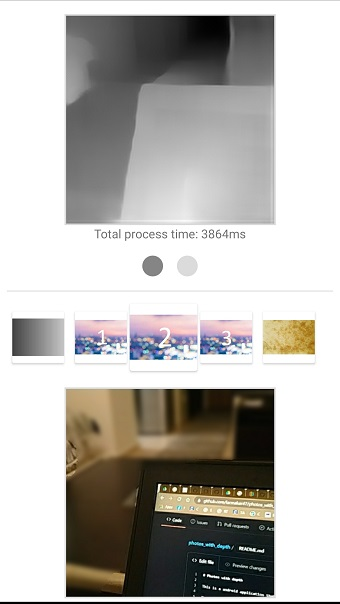
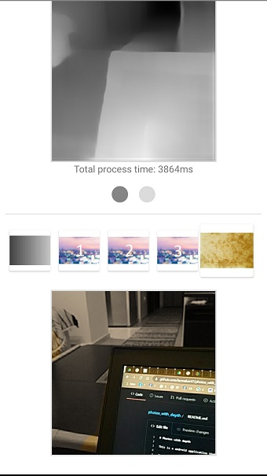

# Photos with depth

This is a android application that uses ML model to estimate depth in photos and produces a bokeh effect.

The model is taken from [this](https://syncedreview.com/2020/04/13/ai-transforms-rgb-d-images-into-an-impressive-3d-format/) paper and it is a CNN-based single depth estimation model. CNN-based methods have recently demonstrated promising results on estimating depth from a single image. Due to the difficulty of collecting labeled datasets, earlier approaches often focus on specific visual domains such as indoor scenes or street view. While the accuracy of these approaches is not yet competitive with multi-view stereo algorithms, that line of research and the output model is particularly promising due to the availability of larger and more diverse training datasets from relative depth annotations, multi-view stereo, 3D movies and synthetic data. For cases where only one single color image is available, they have obtained the depth estimation through a pre-trained depth estimation model. Removing the dependency on stereo or multiple images as input has made their method more widely applicable to all the existing photos.

The model that we used was written in __Pytorch__. With the provided colab notebook at the master branch you can follow along and see the conversion to ONNX, TensorFlow and finally to TensorFlow Lite to obtain the model that was finally used inside the android application. Inside the notebook you can observe all the pre and post-process of the images so an array will be available to be used with the TensorFlow Lite Interpreter. Pytorch models expect [1, 3, Width, Height] format of the inputs and so does the final TensorFlow Lite model. Due to that, usage of an array as input is mandatory and TensorFow Lite Support or TensorFow Lite Metadata libraries were not used in this project.

The output of the model is an array of [1, 1, Width, Height] shape. This array is converted to a grayscale image and then on screen you can observe the input image and a grayscale one with the depth estimation in various tones of gray. Selecting specific values of pixels above a certain number we focus on the objects inside the image that are closer to the camera. That objects remain unchanged and the background is converted to B/W, blurred or sepia. Below you can see some mobile selfie screenshots:

  

and screenshots when the background camera is used inside a room:

  

## Explore the code

We're now going to walk through the most important parts of the sample code.

This application uses CameraX to get an image from the front or back camera. You can see the implementation inside [`CameraFragment.kt`](https://github.com/farmaker47/photos_with_depth/blob/master/app/src/main/java/com/soloupis/sample/photos_with_depth/fragments/CameraFragment.kt) class. You can also load an image from the phone's gallery.

The [`ImageUtils.kt`](https://github.com/farmaker47/photos_with_depth/blob/master/app/src/main/java/com/soloupis/sample/photos_with_depth/utils/ImageUtils.kt) class contains the basic code for pre-processing the image and create the float array of size [1, 3, Width, Height] that is going to be used from the interpreter.

```
fun bitmapToFloatArray(bitmap: Bitmap):
                Array<Array<Array<FloatArray>>> {
            val width: Int = bitmap.width
            val height: Int = bitmap.height
            val intValues = IntArray(width * height)
            bitmap.getPixels(intValues, 0, width, 0, 0, width, height)

            val floatArray = Array(1) {
                Array(3) {
                    Array(width) {
                        FloatArray(height)
                    }
                }
            }

            for (i in 0 until width - 1) {
                for (j in 0 until height - 1) {
                    val pixelValue: Int = intValues[i * width + j]
                    floatArray[0][0][i][j] =
                        Color.red(pixelValue) / 255.0f // or  (pixelValue shr 16 and 0xff).toFloat() / 255.0f
                    floatArray[0][1][i][j] =
                        Color.green(pixelValue) / 255.0f // or (pixelValue shr 8 and 0xff).toFloat() / 255.0f
                    floatArray[0][2][i][j] =
                        Color.blue(pixelValue) / 255.0f // or (pixelValue and 0xff).toFloat() / 255.0f
                }

            }

            return floatArray
}
```

then inside [`DepthAndStyleModelExecutor.kt`](https://github.com/farmaker47/photos_with_depth/blob/master/app/src/main/java/com/soloupis/sample/photos_with_depth/fragments/segmentation/DepthAndStyleModelExecutor.kt) class 
interpreter uses the above float array and gives the result which is also a float array of shape [1, 1, Width, Height].

```
fun executeProcedureForPhotosWithDepth(
        contentImage: Bitmap,
        context: Context
    ): Pair<Bitmap, Bitmap> {
        try {
            Log.i(TAG, "running models")
            fullExecutionTime = SystemClock.uptimeMillis()

            // Creates inputs for reference.
            // This model expects a 1,3,384,384 input so it is impossible to use Support Library and byteBuffer
            // So we go with plain array inputs and outputs

            preProcessTime = SystemClock.uptimeMillis()
            //var loadedBitmap = ImageUtils.loadBitmapFromResources(context, "thumbnails/agray.jpg")
            //val inputStyle = ImageUtils.bitmapToByteBuffer(loadedBitmap, CONTENT_IMAGE_SIZE, CONTENT_IMAGE_SIZE)
            val loadedBitmap = Bitmap.createScaledBitmap(
                contentImage,
                CONTENT_IMAGE_SIZE,
                CONTENT_IMAGE_SIZE,
                true
            )

            // Convert Bitmap to Float array
            val inputStyle = ImageUtils.bitmapToFloatArray(loadedBitmap)
            Log.i(TAG, inputStyle[0][0][0].contentToString())

            // Create an output array with size 1,1,384,384
            val outputs = Array(1) {
                Array(1) {
                    Array(CONTENT_IMAGE_SIZE) {
                        FloatArray(CONTENT_IMAGE_SIZE)
                    }
                }
            }
            preProcessTime = SystemClock.uptimeMillis() - preProcessTime
            Log.d(TAG, "Pre process time: $preProcessTime")

            // Runs model inference and gets result.
            findDepthTime = SystemClock.uptimeMillis()
            interpreterDepth.run(inputStyle, outputs)
            Log.d(TAG, "Output array: " + outputs[0][0][0].contentToString())
            findDepthTime = SystemClock.uptimeMillis() - findDepthTime
            Log.d(TAG, "Find depth time: $findDepthTime")

            // Post process time
            postProcessTime = SystemClock.uptimeMillis()
            // Convert output array to Bitmap
            val (finalBitmapGrey, finalBitmapBlack) = ImageUtils.convertArrayToBitmap(
                outputs, CONTENT_IMAGE_SIZE,
                CONTENT_IMAGE_SIZE
            )
            postProcessTime = SystemClock.uptimeMillis() - postProcessTime
            Log.d(TAG, "Post process time: $postProcessTime")

            // Full execution time
            fullExecutionTime = SystemClock.uptimeMillis() - fullExecutionTime
            Log.d(TAG, "Time to run everything: $fullExecutionTime")

            // Return grayscale image (model output) to show this on screen and a bitmap that is going to be used for styled background
            return Pair(
                finalBitmapGrey,
                finalBitmapBlack
            )
}
```

Finally the output array is converted to a grayscale image so this can be shown at user's screen. This function is also inside [`ImageUtils.kt`](https://github.com/farmaker47/photos_with_depth/blob/master/app/src/main/java/com/soloupis/sample/photos_with_depth/utils/ImageUtils.kt) class.

```
fun convertArrayToBitmap(
            imageArray: Array<Array<Array<FloatArray>>>,
            imageWidth: Int,
            imageHeight: Int
        ): Pair<Bitmap, Bitmap> {

            // Convert multidimensional array to 1D
            val oneDFloatArray = ArrayList<Float>()

            for (m in imageArray[0].indices) {
                for (x in imageArray[0][0].indices) {
                    for (y in imageArray[0][0][0].indices) {
                        oneDFloatArray.add(imageArray[0][0][x][y])
                    }
                }
            }

            val maxValue: Float = oneDFloatArray.max() ?: 0f
            val minValue: Float = oneDFloatArray.min() ?: 0f

            val conf = Bitmap.Config.ARGB_8888 // see other conf types
            val grayToneImage = Bitmap.createBitmap(imageWidth, imageHeight, conf)
            val blackWhiteImage = Bitmap.createBitmap(imageWidth, imageHeight, conf)

            // Use manipulation like Colab post processing......  // 255 * (depth - depth_min) / (depth_max - depth_min)
            for (x in imageArray[0][0].indices) {
                for (y in imageArray[0][0][0].indices) {

                    // Create black and transparent bitmap based on pixel value above a certain number eg. 150
                    // make all pixels black in case value of grayscale image is above 150
                    blackWhiteImage.setPixel(
                        y,
                        x,
                        if ((255 * (imageArray[0][0][x][y] - minValue) / (maxValue - minValue)).toInt() > 150) Color.BLACK else Color.TRANSPARENT
                    )

                    // Create grayscale image to show on screen after inference
                    val color = Color.rgb(
                        (255 * (imageArray[0][0][x][y] - minValue) / (maxValue - minValue)).toInt(), //((imageArray[0][0][x][y] * 255).toInt()),
                        (255 * (imageArray[0][0][x][y] - minValue) / (maxValue - minValue)).toInt(),//((imageArray[0][0][x][y] * 255).toInt()),
                        (255 * (imageArray[0][0][x][y] - minValue) / (maxValue - minValue)).toInt()//(imageArray[0][0][x][y] * 255).toInt()
                    )

                    // this y, x is in the correct order!!!
                    grayToneImage.setPixel(y, x, color)
                }
            }
            return Pair(grayToneImage, blackWhiteImage)
 }
 ```
Above function returns a grayscale image that is immediately shown on users screen and a black/transparent one that is going to be used to create the final gray, blurred or sepia background. By changing the value of the pixels' color (here it is 150) you can choose what objects are going to be shown unchanged on screen.  Comments are displayed inside the function and guides to specific bitmap creations. The two bitmaps are returned inside [`DepthAndStyleFragment.kt`](https://github.com/farmaker47/photos_with_depth/blob/master/app/src/main/java/com/soloupis/sample/photos_with_depth/fragments/segmentation/DepthAndStyleFragment.kt) class and the user by clicking one of the styles gets the generated image with the foreground unchanged and the background with the desired style (blurred for example):


This effect is created with [PorterDuff.Mode](https://developer.android.com/reference/android/graphics/PorterDuff.Mode) and you can observe the image compositing inside [`DepthAndStyleViewModel.kt`](https://github.com/farmaker47/photos_with_depth/blob/master/app/src/main/java/com/soloupis/sample/photos_with_depth/fragments/segmentation/DepthAndStyleViewModel.kt#L95) class (`cropBitmapWithMask` function). 

### Useful links

[Youtube video](https://youtu.be/INaIzXlVHq8).


